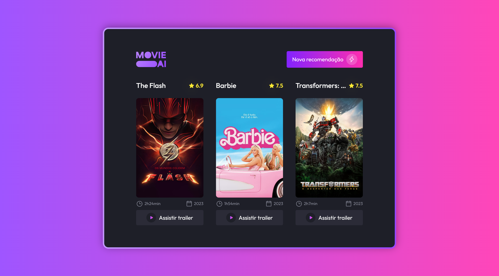

<h1 align="center"> Movie - IA | BoraCodar#30 </h1>

[Clique aqui para acessar](https://movie-ia.vercel.app/)

## 🚀 Tecnologias

Esse projeto foi desenvolvido com as seguintes tecnologias:

- [React.js](https://react.dev/)
- [Typescript](https://www.typescriptlang.org/)
- [Tailwind CSS](https://tailwindcss.com/)
- [TMDb API](https://developer.themoviedb.org/docs)
- Git and GitHub

## 💻 Projeto

O projeto "Movie - IA" é uma interface que simula a geração de filmes recomendados por IA (Inteligência Artificial).  

Projeto construído a partir do layout proposto no desafio [#BoraCodar30](https://boracodar.dev/) realizado pela [Rocketseat](https://rocketseat.com.br).
Após o desenvolvimento do projeto inicial, adicionei novas features, tais quais:

- Layout responsivo (Adaptado para telas menores);
- Dados dinâmicos;
- Efeitos hover;
- Animação de carregamento/entrada;
- Entre outras pequenas modificações.

## 🔖 Layout

Você pode visualizar o layout do projeto proposto através [DESSE LINK](https://www.figma.com/community/file/1266028958590001589). É necessário ter conta no [Figma](https://figma.com) para acessá-lo.